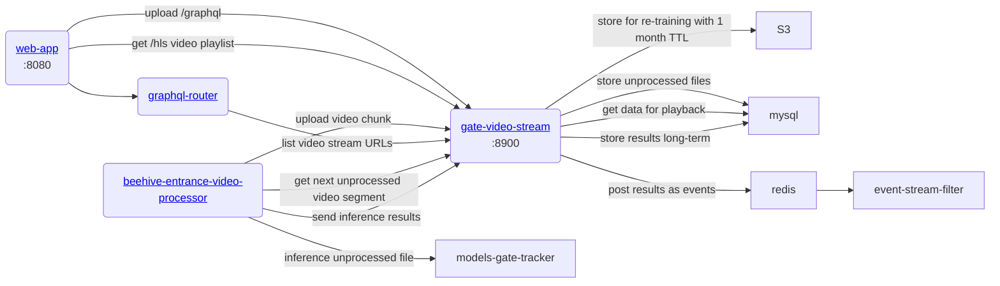

# gratheon / gate-video-stream
Main backend video processng microservice.
In UI videos are uploaded from this component:


## Features
- Converts webm videos to mp4 for HLS playback
- Uploads short 10s video segments to S3 for long-term storage
- Stores some results in mysql db
- Theoretically can post videos to be inferenced, but not in use yet as we don't have GPU hosting enabled. Relying on edge devices for now.

## Limits
Max - 40 MB video file size limit.

### API
- Exposes /hls REST endpoint for video playback in web-app
- Exposes /graphql endpoint to upload short 10s videos from hive entrances

### URLs
- localhost:8900 - graphql endpoint
- localhost:8950 - hls/REST endpoint

## Architecture



### Database
- Stream - video session that has multiple 10s segments. 
- Segment - part of the stream. Contains statistics on found bees coming in/out.

### Development
```
make start
```
