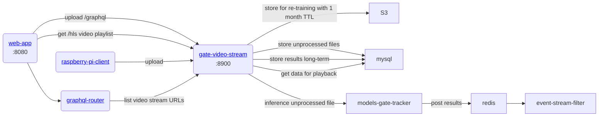

# gratheon / gate-video-stream
Main video processng microservice.

- Exposes /graphql endpoint to upload short 5s videos from hive entrances
- Uploads it to S3 for long-term storage
- Exposes /hls REST endpoint for video playback in web-app
- [TODO] Posts video to inference

### URLs
localhost:8900

## Architecture



### Development
```
make start
```
