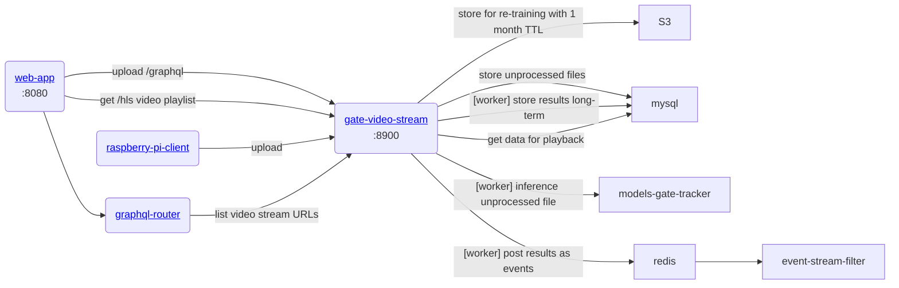

# gratheon / gate-video-stream
Main video processng microservice.

- Converts webm videos to mp4 for HLS playback
- Uploads short 10s video segments to S3 for long-term storage
- Posts video to inference
- Stores detected results in DB


### API
- Exposes /hls REST endpoint for video playback in web-app
- Exposes /graphql endpoint to upload short 10s videos from hive entrances

### URLs
- localhost:8900 - graphql endpoint
- localhost:8950 - hls/REST endpoint

## Architecture



### Database
- Stream - video session that has multiple 10s segments. 
- Segment - part of the stream. Contains statistics on found bees coming in/out.

### Development
```
make start
```